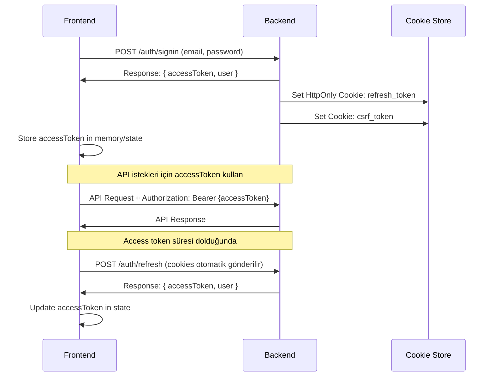

# ProcurementFlow Auth Frontend Entegrasyonu Rehberi

## İçindekiler
- [Genel Bakış](#genel-bakış)
- [Token Yönetimi](#token-yönetimi)
- [API Entegrasyonu](#api-entegrasyonu)
- [Güvenlik Uygulamaları](#güvenlik-uygulamaları)
- [React/Vue/Angular Örnekleri](#reactvueangular-örnekleri)
- [Error Handling](#error-handling)
- [Best Practices](#best-practices)
- [Troubleshooting](#troubleshooting)

## Genel Bakış

ProcurementFlow auth sistemi, modern güvenlik standartlarını takip eden JWT tabanlı bir kimlik doğrulama sistemi kullanır. Frontend uygulamanızın bu sisteme bağlanması için gerekli tüm bilgiler bu dokümanda yer almaktadır.

### Temel Konseptler

1. **Access Token**: API istekleri için kullanılan kısa süreli (15 dakika) JWT token
2. **Refresh Token**: Access token'ı yenilemek için kullanılan uzun süreli (7 gün) token (HttpOnly cookie)
3. **CSRF Token**: State-changing işlemler için gerekli güvenlik token'ı
4. **Session Management**: Cihaz bazlı oturum takibi
5. **MFA (Multi-Factor Authentication)**: İki faktörlü doğrulama desteği

## Token Yönetimi

### Token Akışı



### Token Saklama Stratejisi

#### ✅ Doğru Yöntem
```javascript
// Access Token - Memory/State'de sakla (XSS'e karşı güvenli)
const [accessToken, setAccessToken] = useState(null);

// Refresh Token - HttpOnly cookie (backend tarafından yönetilir)
// CSRF Token - Normal cookie (client okuyabilir)
```

#### ❌ Yanlış Yöntemler
```javascript
// LocalStorage'da token saklamayın (XSS riski)
localStorage.setItem('token', accessToken); // SAKMAYIN!

// SessionStorage'da token saklamayın (XSS riski)
sessionStorage.setItem('token', accessToken); // SAKMAYIN!
```

## API Entegrasyonu

### Base API Konfigürasyonu

```javascript
// api.js
const BASE_URL = 'http://localhost:3000/api';

class ApiClient {
  constructor() {
    this.accessToken = null;
    this.isRefreshing = false;
    this.failedQueue = [];
  }

  // Access token'ı ayarla
  setAccessToken(token) {
    this.accessToken = token;
  }

  // CSRF token'ını cookie'den al
  getCsrfToken() {
    return document.cookie
      .split('; ')
      .find(row => row.startsWith('csrf_token='))
      ?.split('=')[1];
  }

  // Base request metodu
  async request(url, options = {}) {
    const config = {
      headers: {
        'Content-Type': 'application/json',
        ...options.headers,
      },
      credentials: 'include', // Cookies için gerekli
      ...options,
    };

    // Access token ekle
    if (this.accessToken) {
      config.headers.Authorization = `Bearer ${this.accessToken}`;
    }

    // CSRF token ekle (POST, PUT, DELETE için)
    if (['POST', 'PUT', 'DELETE'].includes(options.method?.toUpperCase())) {
      const csrfToken = this.getCsrfToken();
      if (csrfToken) {
        config.headers['X-CSRF-Token'] = csrfToken;
      }
    }

    try {
      const response = await fetch(`${BASE_URL}${url}`, config);
      
      // 401 durumunda token yenileme
      if (response.status === 401 && !url.includes('/auth/')) {
        return this.handleTokenRefresh(url, config);
      }

      return response;
    } catch (error) {
      throw error;
    }
  }

  // Token yenileme işlemi
  async handleTokenRefresh(originalUrl, originalConfig) {
    if (this.isRefreshing) {
      // Zaten yenileme yapılıyorsa, kuyruğa ekle
      return new Promise((resolve, reject) => {
        this.failedQueue.push({ resolve, reject, url: originalUrl, config: originalConfig });
      });
    }

    this.isRefreshing = true;

    try {
      const refreshResponse = await fetch(`${BASE_URL}/auth/refresh`, {
        method: 'POST',
        credentials: 'include',
      });

      if (refreshResponse.ok) {
        const data = await refreshResponse.json();
        this.setAccessToken(data.tokens.accessToken);

        // Kuyrukta bekleyen istekleri yeniden gönder
        this.processQueue(null);

        // Orijinal isteği tekrar dene
        originalConfig.headers.Authorization = `Bearer ${data.tokens.accessToken}`;
        return fetch(`${BASE_URL}${originalUrl}`, originalConfig);
      } else {
        // Refresh başarısız, logout yap
        this.processQueue(new Error('Token refresh failed'));
        this.logout();
        throw new Error('Authentication failed');
      }
    } catch (error) {
      this.processQueue(error);
      this.logout();
      throw error;
    } finally {
      this.isRefreshing = false;
    }
  }

  // Kuyruk işleme
  processQueue(error) {
    this.failedQueue.forEach(({ resolve, reject, url, config }) => {
      if (error) {
        reject(error);
      } else {
        config.headers.Authorization = `Bearer ${this.accessToken}`;
        resolve(fetch(`${BASE_URL}${url}`, config));
      }
    });
    this.failedQueue = [];
  }

  // Logout
  logout() {
    this.accessToken = null;
    // Kullanıcıyı login sayfasına yönlendir
    window.location.href = '/login';
  }

  // HTTP metodları
  async get(url, options = {}) {
    return this.request(url, { method: 'GET', ...options });
  }

  async post(url, data, options = {}) {
    return this.request(url, {
      method: 'POST',
      body: JSON.stringify(data),
      ...options,
    });
  }

  async put(url, data, options = {}) {
    return this.request(url, {
      method: 'PUT',
      body: JSON.stringify(data),
      ...options,
    });
  }

  async delete(url, options = {}) {
    return this.request(url, { method: 'DELETE', ...options });
  }
}

const apiClient = new ApiClient();
export default apiClient;
```

### Auth Service

```javascript
// authService.js
import apiClient from './api';

class AuthService {
  // Kayıt ol
  async signup(userData) {
    const response = await apiClient.post('/auth/signup', userData);
    
    if (response.ok) {
      const data = await response.json();
      apiClient.setAccessToken(data.tokens.accessToken);
      return data;
    }
    
    throw new Error(await response.text());
  }

  // Giriş yap
  async signin(email, password, mfaCode = null) {
    const response = await apiClient.post('/auth/signin', {
      email,
      password,
      mfaCode
    });

    if (response.ok) {
      const data = await response.json();
      
      // MFA gerekli mi?
      if (data.user.mfaRequired) {
        return { requiresMfa: true };
      }
      
      apiClient.setAccessToken(data.tokens.accessToken);
      return data;
    }

    throw new Error(await response.text());
  }

  // Çıkış yap
  async logout() {
    try {
      await apiClient.post('/auth/logout');
    } catch (error) {
      console.error('Logout error:', error);
    } finally {
      apiClient.setAccessToken(null);
      window.location.href = '/login';
    }
  }

  // Token yenile
  async refreshToken() {
    const response = await apiClient.post('/auth/refresh');
    
    if (response.ok) {
      const data = await response.json();
      apiClient.setAccessToken(data.tokens.accessToken);
      return data;
    }
    
    throw new Error('Token refresh failed');
  }

  // Şifre sıfırlama talebi
  async forgotPassword(email) {
    const response = await apiClient.post('/auth/forgot-password', { email });
    
    if (!response.ok) {
      throw new Error(await response.text());
    }
    
    return response.json();
  }

  // Şifre sıfırla
  async resetPassword(token, newPassword) {
    const response = await apiClient.post('/auth/reset-password', {
      token,
      newPassword
    });
    
    if (!response.ok) {
      throw new Error(await response.text());
    }
    
    return response.json();
  }

  // Şifre değiştir
  async changePassword(currentPassword, newPassword) {
    const response = await apiClient.put('/auth/change-password', {
      currentPassword,
      newPassword
    });
    
    if (!response.ok) {
      throw new Error(await response.text());
    }
    
    return response.json();
  }

  // Email doğrula
  async verifyEmail(token) {
    const response = await apiClient.post('/auth/verify-email', { token });
    
    if (!response.ok) {
      throw new Error(await response.text());
    }
    
    return response.json();
  }

  // Mevcut kullanıcı bilgilerini al
  async getCurrentUser() {
    const response = await apiClient.get('/auth/me');
    
    if (response.ok) {
      return response.json();
    }
    
    throw new Error('Failed to get current user');
  }

  // MFA kurulumu başlat
  async setupMfa() {
    const response = await apiClient.get('/auth/mfa/setup');
    
    if (response.ok) {
      return response.json();
    }
    
    throw new Error('Failed to setup MFA');
  }

  // MFA'yı etkinleştir
  async enableMfa(secret, verificationCode, backupCodes) {
    const response = await apiClient.post('/auth/mfa/enable', {
      secret,
      verificationCode,
      backupCodes
    });
    
    if (!response.ok) {
      throw new Error(await response.text());
    }
    
    return response.json();
  }

  // MFA'yı devre dışı bırak
  async disableMfa(password) {
    const response = await apiClient.post('/auth/mfa/disable', { password });
    
    if (!response.ok) {
      throw new Error(await response.text());
    }
    
    return response.json();
  }

  // Oturumları listele
  async getSessions() {
    const response = await apiClient.get('/auth/sessions');
    
    if (response.ok) {
      return response.json();
    }
    
    throw new Error('Failed to get sessions');
  }

  // Oturum sonlandır
  async revokeSession(sessionId) {
    const response = await apiClient.delete(`/auth/sessions/${sessionId}`);
    
    if (!response.ok) {
      throw new Error(await response.text());
    }
    
    return response.json();
  }

  // Tüm diğer oturumları sonlandır
  async revokeAllSessions() {
    const response = await apiClient.delete('/auth/sessions');
    
    if (!response.ok) {
      throw new Error(await response.text());
    }
    
    return response.json();
  }
}

const authService = new AuthService();
export default authService;
```

## Güvenlik Uygulamaları

### 1. CSRF Koruması

```javascript
// Her state-changing request'de CSRF token gönder
const csrfToken = document.cookie
  .split('; ')
  .find(row => row.startsWith('csrf_token='))
  ?.split('=')[1];

fetch('/api/auth/change-password', {
  method: 'PUT',
  headers: {
    'Content-Type': 'application/json',
    'X-CSRF-Token': csrfToken, // Gerekli!
    'Authorization': `Bearer ${accessToken}`
  },
  credentials: 'include',
  body: JSON.stringify(data)
});
```

### 2. XSS Koruması

```javascript
// Access token'ı asla DOM'da saklamayın
// LocalStorage/SessionStorage kullanmayın

// Güvenli yöntem - State/Memory'de sakla
const [user, setUser] = useState(null);
const [accessToken, setAccessToken] = useState(null);

// Page refresh durumunda token kontrolü
useEffect(() => {
  checkAuthStatus();
}, []);

async function checkAuthStatus() {
  try {
    // Refresh token cookie'den kontrol et
    await authService.refreshToken();
  } catch (error) {
    // Kullanıcı giriş yapmamış
    setUser(null);
    setAccessToken(null);
  }
}
```

### 3. Route Koruması

```javascript
// ProtectedRoute.jsx
import { Navigate } from 'react-router-dom';
import { useAuth } from './AuthContext';

function ProtectedRoute({ children, requireMfa = false }) {
  const { user, isLoading } = useAuth();

  if (isLoading) {
    return <div>Loading...</div>;
  }

  if (!user) {
    return <Navigate to="/login" replace />;
  }

  if (requireMfa && !user.mfaEnabled) {
    return <Navigate to="/setup-mfa" replace />;
  }

  return children;
}

export default ProtectedRoute;
```

## React/Vue/Angular Örnekleri

### React Context Örneği

```jsx
// AuthContext.jsx
import React, { createContext, useContext, useState, useEffect } from 'react';
import authService from './services/authService';

const AuthContext = createContext();

export function useAuth() {
  return useContext(AuthContext);
}

export function AuthProvider({ children }) {
  const [user, setUser] = useState(null);
  const [isLoading, setIsLoading] = useState(true);

  useEffect(() => {
    checkAuthStatus();
  }, []);

  async function checkAuthStatus() {
    try {
      const userData = await authService.getCurrentUser();
      setUser(userData);
    } catch (error) {
      setUser(null);
    } finally {
      setIsLoading(false);
    }
  }

  async function login(email, password, mfaCode = null) {
    const result = await authService.signin(email, password, mfaCode);
    
    if (result.requiresMfa) {
      return { requiresMfa: true };
    }
    
    setUser(result.user);
    return result;
  }

  async function logout() {
    await authService.logout();
    setUser(null);
  }

  async function signup(userData) {
    const result = await authService.signup(userData);
    setUser(result.user);
    return result;
  }

  const value = {
    user,
    isLoading,
    login,
    logout,
    signup,
    checkAuthStatus
  };

  return (
    <AuthContext.Provider value={value}>
      {children}
    </AuthContext.Provider>
  );
}
```

### Vue Composition API Örneği

```javascript
// useAuth.js
import { ref, onMounted } from 'vue';
import authService from './services/authService';

const user = ref(null);
const isLoading = ref(true);

export function useAuth() {
  onMounted(async () => {
    await checkAuthStatus();
  });

  async function checkAuthStatus() {
    try {
      const userData = await authService.getCurrentUser();
      user.value = userData;
    } catch (error) {
      user.value = null;
    } finally {
      isLoading.value = false;
    }
  }

  async function login(email, password, mfaCode = null) {
    const result = await authService.signin(email, password, mfaCode);
    
    if (result.requiresMfa) {
      return { requiresMfa: true };
    }
    
    user.value = result.user;
    return result;
  }

  async function logout() {
    await authService.logout();
    user.value = null;
  }

  return {
    user,
    isLoading,
    login,
    logout,
    checkAuthStatus
  };
}
```

### Angular Service Örneği

```typescript
// auth.service.ts
import { Injectable } from '@angular/core';
import { BehaviorSubject, Observable } from 'rxjs';
import { HttpClient } from '@angular/common/http';

interface User {
  id: string;
  email: string;
  fullName: string;
  role: string;
  mfaEnabled: boolean;
}

@Injectable({
  providedIn: 'root'
})
export class AuthService {
  private userSubject = new BehaviorSubject<User | null>(null);
  public user$ = this.userSubject.asObservable();

  constructor(private http: HttpClient) {
    this.checkAuthStatus();
  }

  async checkAuthStatus(): Promise<void> {
    try {
      const user = await this.http.get<User>('/api/auth/me').toPromise();
      this.userSubject.next(user);
    } catch (error) {
      this.userSubject.next(null);
    }
  }

  async login(email: string, password: string, mfaCode?: string): Promise<any> {
    const result = await this.http.post<any>('/api/auth/signin', {
      email,
      password,
      mfaCode
    }).toPromise();

    if (!result.requiresMfa) {
      this.userSubject.next(result.user);
    }

    return result;
  }

  async logout(): Promise<void> {
    await this.http.post('/api/auth/logout', {}).toPromise();
    this.userSubject.next(null);
  }

  get currentUser(): User | null {
    return this.userSubject.value;
  }

  get isAuthenticated(): boolean {
    return !!this.userSubject.value;
  }
}
```

## Error Handling

### Error Types ve Handling

```javascript
// errorHandler.js
export class AuthError extends Error {
  constructor(message, code, status) {
    super(message);
    this.name = 'AuthError';
    this.code = code;
    this.status = status;
  }
}

export function handleAuthError(error, response) {
  const status = response?.status;
  
  switch (status) {
    case 400:
      throw new AuthError('Geçersiz istek', 'INVALID_REQUEST', 400);
    case 401:
      throw new AuthError('Kimlik doğrulama başarısız', 'UNAUTHORIZED', 401);
    case 403:
      if (error.message?.includes('locked')) {
        throw new AuthError('Hesap geçici olarak kilitlendi', 'ACCOUNT_LOCKED', 403);
      }
      throw new AuthError('Erişim reddedildi', 'FORBIDDEN', 403);
    case 409:
      throw new AuthError('Email zaten kullanımda', 'EMAIL_EXISTS', 409);
    case 429:
      throw new AuthError('Çok fazla deneme. Lütfen bekleyin.', 'RATE_LIMITED', 429);
    default:
      throw new AuthError('Bilinmeyen hata', 'UNKNOWN_ERROR', status || 500);
  }
}

// Kullanım örneği
try {
  await authService.signin(email, password);
} catch (error) {
  if (error instanceof AuthError) {
    switch (error.code) {
      case 'ACCOUNT_LOCKED':
        showMessage('Hesabınız geçici olarak kilitlendi. 30 dakika sonra tekrar deneyin.');
        break;
      case 'RATE_LIMITED':
        showMessage('Çok fazla deneme yaptınız. Lütfen daha sonra tekrar deneyin.');
        break;
      default:
        showMessage(error.message);
    }
  }
}
```

### Form Validation

```javascript
// validation.js
export function validateEmail(email) {
  const emailRegex = /^[^\s@]+@[^\s@]+\.[^\s@]+$/;
  return emailRegex.test(email);
}

export function validatePassword(password) {
  const errors = [];
  
  if (password.length < 8) {
    errors.push('Şifre en az 8 karakter olmalıdır');
  }
  
  if (!/[A-Z]/.test(password)) {
    errors.push('Şifre en az bir büyük harf içermelidir');
  }
  
  if (!/[a-z]/.test(password)) {
    errors.push('Şifre en az bir küçük harf içermelidir');
  }
  
  if (!/\d/.test(password)) {
    errors.push('Şifre en az bir rakam içermelidir');
  }
  
  if (!/[!@#$%^&*()_+\-=\[\]{};':"\\|,.<>\/?]/.test(password)) {
    errors.push('Şifre en az bir özel karakter içermelidir');
  }
  
  return {
    isValid: errors.length === 0,
    errors
  };
}
```

## Best Practices

### 1. Token Lifecycle Management

```javascript
class TokenManager {
  constructor() {
    this.accessToken = null;
    this.tokenExpiryTime = null;
    this.refreshInterval = null;
  }

  setAccessToken(token) {
    this.accessToken = token;
    
    // JWT payload'ını decode et
    const payload = JSON.parse(atob(token.split('.')[1]));
    this.tokenExpiryTime = payload.exp * 1000;
    
    // Token süresinin %80'i geçince yenile
    const refreshTime = this.tokenExpiryTime - Date.now() - (5 * 60 * 1000); // 5 dakika önce
    
    clearTimeout(this.refreshInterval);
    this.refreshInterval = setTimeout(() => {
      this.refreshToken();
    }, refreshTime);
  }

  async refreshToken() {
    try {
      const response = await authService.refreshToken();
      this.setAccessToken(response.tokens.accessToken);
    } catch (error) {
      // Refresh başarısız, logout yap
      authService.logout();
    }
  }

  clearToken() {
    this.accessToken = null;
    this.tokenExpiryTime = null;
    clearTimeout(this.refreshInterval);
  }
}
```

### 2. Loading States

```jsx
// LoadingButton.jsx
function LoadingButton({ isLoading, children, ...props }) {
  return (
    <button disabled={isLoading} {...props}>
      {isLoading ? (
        <>
          <Spinner size="sm" />
          İşleniyor...
        </>
      ) : (
        children
      )}
    </button>
  );
}

// Login formu örneği
function LoginForm() {
  const [isLoading, setIsLoading] = useState(false);
  const [formData, setFormData] = useState({ email: '', password: '' });

  async function handleSubmit(e) {
    e.preventDefault();
    setIsLoading(true);

    try {
      await authService.signin(formData.email, formData.password);
      // Başarılı giriş
    } catch (error) {
      // Hata handling
    } finally {
      setIsLoading(false);
    }
  }

  return (
    <form onSubmit={handleSubmit}>
      {/* Form alanları */}
      <LoadingButton type="submit" isLoading={isLoading}>
        Giriş Yap
      </LoadingButton>
    </form>
  );
}
```

### 3. MFA Implementation

```jsx
// MFASetup.jsx
function MFASetup() {
  const [step, setStep] = useState(1); // 1: QR, 2: Verify, 3: Backup Codes
  const [mfaData, setMfaData] = useState(null);
  const [verificationCode, setVerificationCode] = useState('');

  async function startMFASetup() {
    const data = await authService.setupMfa();
    setMfaData(data);
  }

  async function verifyAndEnable() {
    await authService.enableMfa(
      mfaData.secret,
      verificationCode,
      mfaData.backupCodes
    );
    setStep(3);
  }

  return (
    <div>
      {step === 1 && (
        <div>
          <h3>QR Kodunu Tarayın</h3>
          
          <button onClick={() => setStep(2)}>Devam</button>
        </div>
      )}
      
      {step === 2 && (
        <div>
          <h3>Doğrulama Kodunu Girin</h3>
          <input
            type="text"
            value={verificationCode}
            onChange={(e) => setVerificationCode(e.target.value)}
            placeholder="6 haneli kod"
            maxLength={6}
          />
          <button onClick={verifyAndEnable}>Etkinleştir</button>
        </div>
      )}
      
      {step === 3 && (
        <div>
          <h3>Yedek Kodlarınız</h3>
          <div>
            {mfaData?.backupCodes.map((code, index) => (
              <div key={index}>{code}</div>
            ))}
          </div>
          <p>Bu kodları güvenli bir yerde saklayın!</p>
        </div>
      )}
    </div>
  );
}
```

### 4. Session Management

```jsx
// SessionManager.jsx
function SessionManager() {
  const [sessions, setSessions] = useState([]);

  useEffect(() => {
    loadSessions();
  }, []);

  async function loadSessions() {
    const sessionData = await authService.getSessions();
    setSessions(sessionData);
  }

  async function revokeSession(sessionId) {
    await authService.revokeSession(sessionId);
    await loadSessions();
  }

  return (
    <div>
      <h3>Aktif Oturumlar</h3>
      {sessions.map(session => (
        <div key={session.id} className="session-item">
          <div>
            <strong>{session.deviceInfo?.browser} - {session.deviceInfo?.os}</strong>
            <span>{session.ipAddress}</span>
            <span>Son aktivite: {new Date(session.lastUsedAt).toLocaleString()}</span>
            {session.isCurrent && <span className="current-badge">Mevcut</span>}
          </div>
          {!session.isCurrent && (
            <button onClick={() => revokeSession(session.id)}>
              Sonlandır
            </button>
          )}
        </div>
      ))}
    </div>
  );
}
```

## Troubleshooting

### Sık Karşılaşılan Sorunlar

#### 1. CORS Hatası
```javascript
// Problem: CORS hatası alıyorum
// Çözüm: Backend'de CORS yapılandırması yapın ve credentials: 'include' kullanın

fetch('/api/auth/signin', {
  method: 'POST',
  credentials: 'include', // Önemli!
  headers: {
    'Content-Type': 'application/json'
  },
  body: JSON.stringify(data)
});
```

#### 2. CSRF Token Eksik
```javascript
// Problem: CSRF token eksik hatası
// Çözüm: Her state-changing request'de CSRF token gönder

const csrfToken = document.cookie
  .split('; ')
  .find(row => row.startsWith('csrf_token='))
  ?.split('=')[1];

// Header'da gönder
headers: {
  'X-CSRF-Token': csrfToken
}
```

#### 3. Token Sürekli Expires Oluyor
```javascript
// Problem: Access token sürekli expire oluyor
// Çözüm: Otomatik refresh mechanism implement edin

class TokenManager {
  async makeRequest(url, options) {
    let response = await fetch(url, options);
    
    if (response.status === 401) {
      // Token refresh dene
      await this.refreshToken();
      
      // İsteği tekrar dene
      options.headers.Authorization = `Bearer ${this.accessToken}`;
      response = await fetch(url, options);
    }
    
    return response;
  }
}
```

#### 4. MFA Sorunları
```javascript
// Problem: MFA kodu kabul edilmiyor
// Çözüm: 
// 1. Doğru time sync olduğundan emin olun
// 2. 6 haneli kod girdiğinizden emin olun
// 3. Backup kodları deneyin

async function verifyMFA(code) {
  // Kod formatını kontrol et
  if (!/^\d{6}$/.test(code)) {
    throw new Error('MFA kodu 6 haneli rakam olmalıdır');
  }
  
  return await authService.signin(email, password, code);
}
```

### Debug Bilgileri

```javascript
// Debug mode için log helper
function debugAuth(message, data) {
  if (process.env.NODE_ENV === 'development') {
    console.group(`🔐 Auth Debug: ${message}`);
    console.log(data);
    console.groupEnd();
  }
}

// Kullanım
debugAuth('Login attempt', { email, timestamp: new Date() });
debugAuth('Token refresh', { tokenExpiry: tokenExpiryTime });
```

### Performans Optimizasyonu

```javascript
// Token cache mechanism
class TokenCache {
  constructor() {
    this.cache = new Map();
    this.cacheExpiry = new Map();
  }

  set(key, value, expiryMs) {
    this.cache.set(key, value);
    this.cacheExpiry.set(key, Date.now() + expiryMs);
  }

  get(key) {
    if (this.cacheExpiry.get(key) < Date.now()) {
      this.cache.delete(key);
      this.cacheExpiry.delete(key);
      return null;
    }
    return this.cache.get(key);
  }
}
```

## Sonuç

Bu rehber, ProcurementFlow auth sistemine güvenli ve etkili bir şekilde bağlanmak için gereken tüm bilgileri içermektedir. Güvenlik en önemli önceliğimiz olduğu için, lütfen bu dokümandaki güvenlik uygulamalarını eksiksiz uygulayın.

### Önemli Hatırlatmalar:
- ✅ Access token'ı asla localStorage'da saklamayın
- ✅ Her state-changing request'de CSRF token gönderin
- ✅ Credentials: 'include' kullanın
- ✅ Token refresh mechanism implement edin
- ✅ Error handling yapın
- ✅ Loading states kullanın
- ✅ Form validation uygulayın

Sorularınız için: [support@procurementflow.com](mailto:support@procurementflow.com)
